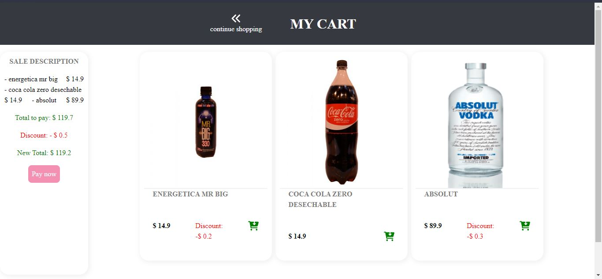

# Resume

Construción de una tienda online que despliegue productos agrupados por la categoría a la que pertenecen. Esta aplicación es la parte frontend que consumira la api bsale-api.

## Estructura

1. **Assets** : Esta carpeta almacena imágenes y/o íconos que se usan en el proyecto.
2. **Css** : Esta carpeta almaceta todos los files de css del proyecto, de ha tratado de clasificarlas de acuerdo a los componentes que dan estilos.
3. **Script** : Esta carpeta contiende todos los scripts, el cual esta clasificada por página, componente y eventos.
4. **Services** : Esta carpeta contien los scripts encargadas de hacer fetch a la api bsale-api y recibir los datos que devuelva la api.

Files especiales

- **dom-handler** : Como estamos trabajando en one-page, lo único que cambian son los datos que muestra esta única página, dom-handler es un objeto que tiene la función load y reload que nos permetiran cargar datos y hacer un refresh de página.

- **api-fetch** : Este es un file especial, lo usamos en el bootcamp para hacer consumo de apis, es una función completa ya que te carga el token, el header, el body si fuera necesario según el request y nos permite manejar el tipo de error con contenido y sin contenido, en este proyecto solo hacemos Get, así que no vemos todo su potencial.

## Funcionamiento de la app

Al iniciar la app, esto será nuestra primera vista.

Lo que se nos muestra son todos los productos en el orden en que la api se nos ha dado, sin filtrar ni ordenar.

En la parte izquierda está el aside de cadegorias el cual nos va permitir saltar de una categoría a otra. En la imagen siguiente estamos en la categoría snack

Se puede usar el selector, que por defecto no esta seleccionado en ninduno, el deplegable tiene todos las modalidades de ordenamiento. En la siguiente imagen se está ordenando por precios.

Se puede usar el buscador, una vez que terminaste de ingresar lo que deseas buscar solo debes dar enter o click en cualquier parte de la pantalla. En la siguiente imagen buscamos papas.

Adicional a esto, tambien los productos que se obtuvieron de la busqueda se pueden ordenar.

Cómo se puede ver en la imagen anterior al dar click sobre el icono cart del producto se pone en verde, se hizo de esta manera para simular que el usuario eligió este producto para comprar.

El icono cart al costado del buscador nos lleva al page sale, donde nos mostrará los productos seleccionados y los detalles de la compra.

Si se da click sobre pay now nos mostrará un mensaje de compra exitosa.

Al dar click sobre cotinue shopping, nos mostrará la primera vista.

Cuando damos click en el icono cart que te lleva a la vista sale, y no se ha seleccionado ningún progucto, debe aparecer el siguiente mensaje:

Y cuando la app no pudo conectarse a la api, debe aparecer lo siguiente:

## Deployment

La aplicación se deployó en heroku: `https://bsale-app-test.herokuapp.com/`

- Nota: para poder deployar, se tuvo que hacer uso de node.
